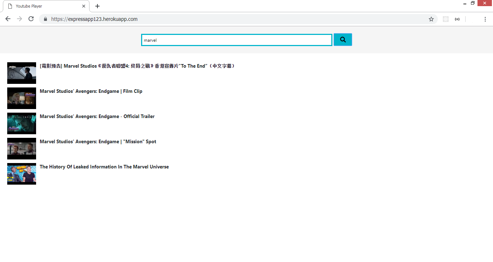
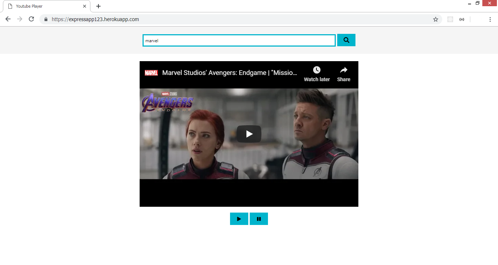
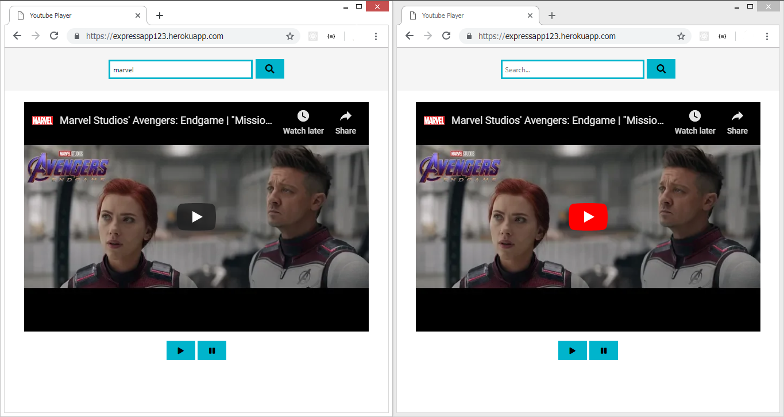

### General info

Created a video player using youtube API to be use for multiple users at the same time.

### Screenshots

You can search for your favorite video and play them

In the browser (1) if you click in “play the video” and this event automatically will play the same video on the browser (1) and the browser (2).

Now when you go to the browser (2), you will be able to pause it and this event will also pause the video on the browser (1)

### Technical Aspects

- Node.JS and modules (Socket.io, express, etc.)
- Third party API (Youtube API)

### I have installed the following NPM packages

- npm install express
- npm install socket.io

#### References

How to deploy a NodeJS app to Heroku from Github
https://medium.freecodecamp.org/how-to-deploy-a-nodejs-app-to-heroku-from-github-without-installing-heroku-on-your-machine-433bec770efe

Heroku Signup
https://signup.heroku.com/login
